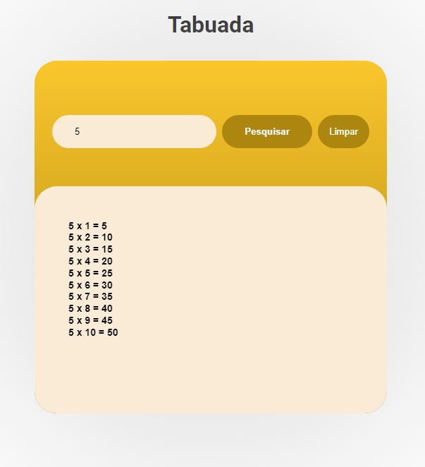
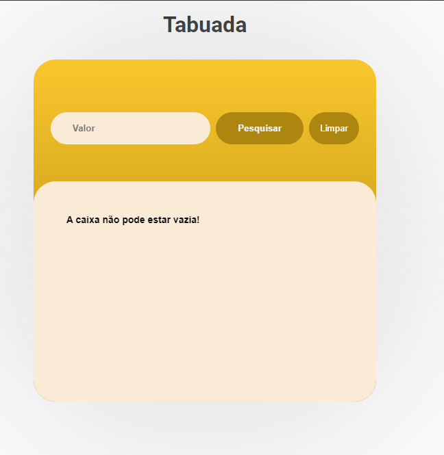
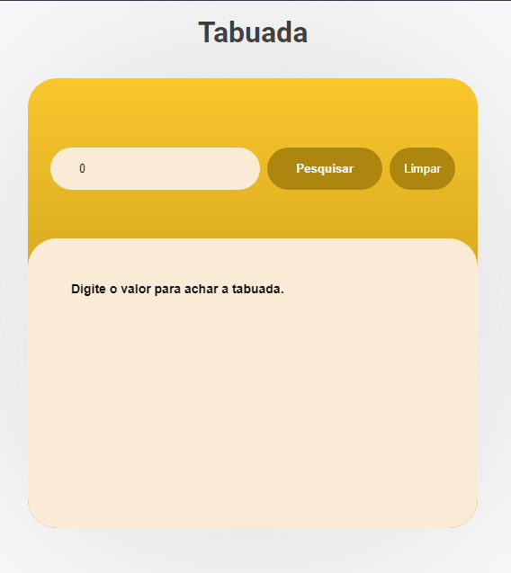

# Objetivo

O objetivo desse projeto foi a fixação da manipulação da DOM usando JavaScript, treimamento de lógica, implementação do pré-processador de CSS SASS.

# USABILIDADE

A aplicação de requerer um numero qualquer e entregar a tabuada do numero até o 10

# Como usar

